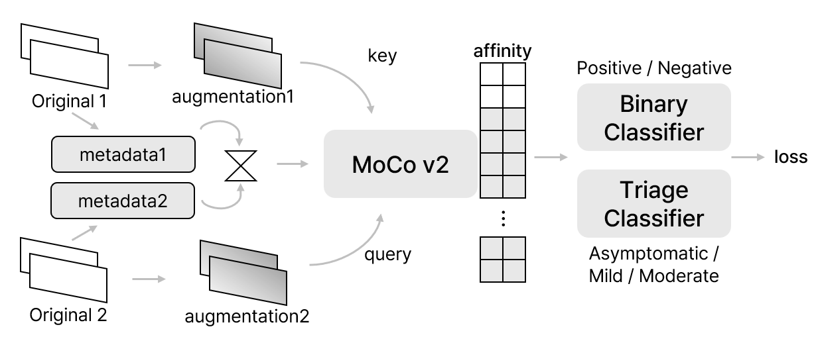
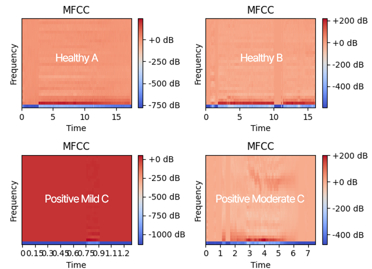
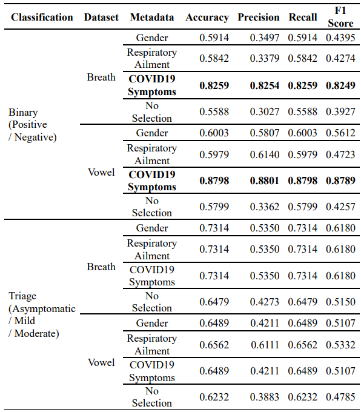
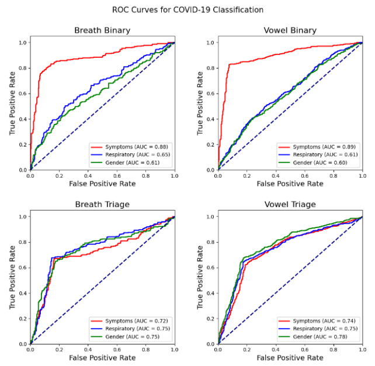

## Autumn Annual Conference of IEIE, 2024 (대한전자공학회 추계학술대회)

<div align="center">
<h3> 환자 메타데이터를 활용한 호흡 및 음성 소리의 대조 학습을 통한 SARS-CoV-2 양음성 및 중증도 진단 </h3>
<h4> Diagnosis of SARS-CoV-2 Positivity and Severity Using Contrastive Learning
on Respiratory and Voice Data with Patient Metadata </h4>

[Seoyeon Oh](https://github.com/sohds)<sup>1</sup>
, [Dayoung Kim](https://github.com/nadayoung)<sup>2</sup>
, and [Yelin Kim](https://github.com/yesyell) <sup>3&dagger;*</sup>
<br>
<sup>1</sup>Seoul Women's University&emsp;
<sup>2</sup>Ewha Womans University&emsp;
<sup>3</sup>Hongik University&emsp;
<br>
[[Paper]](https://www.dbpia.co.kr/journal/articleDetail?nodeId=NODE12036324) [[Code]](https://github.com/sohds/covid19-diagnosis-using-cough-vowel)
[[Notion]](https://www.notion.so/deepdaiv/166cfba5895544e387ac56bc1b3241cc?pvs=4)<br>

당신의 목소리는 코로나를 알고 있다! <br>
Contrastive Learning으로 호흡음과 음성 소리, 환자의 메타데이터를 활용해 COVID-19의 양음성 진단과 중증도 진단하기


<br>

<br>
Proposed Model Architecture
</div>

<br>
<br>

## 🔮 Abstract
- This study aims to develop a COVID-19 (SARS-CoV-2) diagnosis model using a contrastive learning based on patients' respiratory and voice data. 
- Apply a contrastive learning techniques to respiratory and voice data by incorporating patient metadata 
    - such as gender, symptoms, and respiratory disease history. 
- Not only predicts COVID-19 positivity/negativity but also assesses the severity of the disease.
- Experimental results indicated that incorporating COVID-19-related metadata significantly enhanced diagnostic accuracy.
    - In particular, a history of respiratory disease proved to be a critical factor in predicting severity.

<br>

## 📝 Setting
```python
# Clone the repository
git clone https://github.com/sohds/covid19-diagnosis-using-cough-vowel.git
cd covid19-diagnosis-using-cough-vowel

# Install the dependencies
# For Run Streamlit Code
pip install -r requirements.txt

# Streamlit Code
streamlit run streamlit/app_local.py
```
<br>

## 📁 Dataset
- [Coswara: A respiratory sounds and symptoms dataset for remote screening of SARS-CoV-2 infection](https://www.nature.com/articles/s41597-023-02266-0)
<div align="center">

<br>
MFCC of vowel 'O'
</div>

<br>

## 📝 Results
<div align="center">


</div>
<br>

### 🗞️ Poster
<div align="center">

</div>
<br>

## 📚 References

[1] 보건복지부, "비대면진료 시범사업 지침 개정안," April 2024.<br>
[2] Faustino, P, et al, "Crackle and Wheeze Detection in Lung Sound Signals Using Convolutional Neural Networks," Annual International Conference of the IEEE Engineering in Medicine & Biology Society (EMBC), 43rd, pp. 345–348. 2021.<br>
[3] Tong, j. y, Sataloff, r. t, "Respiratory Function and Voice: The Role for Airflow Measures," Journal of Voice, Vol. 36, no. 4, pp. 542–553, 2022.<br>
[4] 김철용, "[해외뉴스] 日 스마트폰으로 환자 호흡음 취득 의료기기," 한국의약통신, [Link](https://www.kmpnews.co.kr/news/articleView.html?idxno=48135), April 2022.<br>
[5] 장세민, "에이아이포펫, 국내 첫 AI 기반 수의사 비대면 진료 서비스 론칭," AI타임스, [Link](https://www.aitimes.com/news/articleView.html?idxno=158037), March 2024.<br>
[6] Aytekin. I, et al, "Covid-19 Detection from Respiratory Sounds with Hierarchical Spectrogram Transformers," IEEE Journal of Biomedical and Health Informatics, Vol. 28, no. 3, pp. 1273–1284, 2023.<br>
[7] Despotovic v, et al, "Detection of COVID-19 from Voice, Cough and Breathing Patterns: Dataset and Preliminary Results," Computers in Biology and Medicine, 2021.<br>
[8] 대한중환자의학회대한결핵 및 호흡기학회대한감염학회대한항균요법학회, "중증 코로나19 감염(COVID-19) 환자 진료 권고안", Vol. 1, 2021.<br>
[9] Bhattacharya. d, et al. "Coswara: A Respiratory Sounds and Symptoms Dataset for Remote Screening of SARS-CoV-2 Infection. Computers in Biology and Medicine," 2023.

<br>
